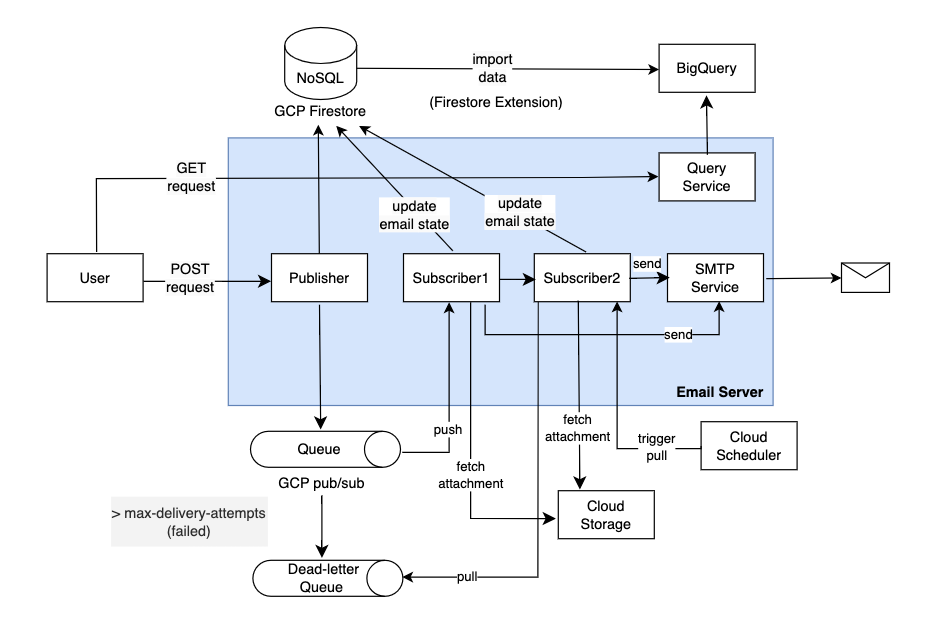

# clean-architecture-email-server


## System Design Diagram



## Server Setup
### Prerequisities
Ensure the following prerequisites are met for smooth operation:

- **Service Account Access**: Ensure that your account has been granted the `Service Account Token Creator` role, allowing it to use the service account `email-server@tw-rd-de-milecoolab-dev.iam.gserviceaccount.com`.

- **GCP Services Setup**: Confirm that the necessary Google Cloud Platform services are properly configured:
  - Pub/Sub
  - Firestore
  - [Stream Firestore to BigQuery extension](https://extensions.dev/extensions/firebase/firestore-bigquery-export)
  - BigQuery (For the schema used to build the view in BigQuery, please see the [View Schema](./bigquery/views/email_data_view.sql))
  - Cloud Storage
  - Cloud Build triggers (Please refer to the `./cloudbuild` folder for detailed configuration)
  - GKE cluster set up 

    ```shell
    # Command for creating a GKE cluster
    gcloud container clusters create "email-server-cluster" \
        --zone "asia-east1-a" \
        --machine-type "e2-micro" \
        --service-account "email-server@tw-rd-de-milecoolab-dev.iam.gserviceaccount.com" \
        --num-nodes "3"
    ```
    (The default cluster name is `email-server-cluster`. If you want to change the cluster name, change the substitution field in this [file](./cloudbuild/cloudbuild_on_push_dev.yaml))

- **Environment Variables**: Copy `example.env`, fill in all the variable names, and rename the file to `.env`.

    Note: You should apply for an app password for your gmail account in advance. For detailed configurations, please refer to [here](https://support.google.com/accounts/answer/185833?hl=en).


### Setting Up the Development Environment
#### Verify Python Version
Before starting, ensure that you are using Python version 3.10, which is required for this project. You can check your current Python version by running:
```shell
python --version
```

#### Start the Poetry Shell
```shell
poetry shell
```

#### Install Dependencies
```shell
poetry install
```

#### Expose Port for Pub/Sub
To expose a local port, first download [ngrok](https://ngrok.com/) and create an account to obtain your Authtoken. Then, use the following commands to authenticate your ngrok client and expose the desired port:
```shell
# Authenticate
ngrok config add-authtoken [YOUR_AUTHTOKEN_HERE]

# Expose port 8080
ngrok http 8080
```
You will receive a URL starting with https (e.g., https://xxx-xxx.ngrok-free.app). Copy this URL and use it as the Pub/Sub subscription endpoint url with the following format:
https://xxx-xxx.ngrok-free.app/v1/queue-email-request


### Authenticate using a service account
Authenticate with Google Cloud to enable secure interactions with GCP services by running the following command:

```
gcloud auth application-default login --impersonate-service-account email-server@tw-rd-de-milecoolab-dev.iam.gserviceaccount.com
```

### Server Startup Methods
#### 1) Start using Docker Compose
```python
docker compose up
```

#### 2) Start using FastAPI command
```
fastapi dev src/main.py --port 8080 
```


## Tests

### Run unittests
```python
python -m unittest discover -s test/unit
```

### Run integration tests
```
docker compose up
python -m unittest discover -s test/integration
```


### Test APIs
#### 1) Postman collections for testing APIs
We have provided a Postman collection for easier testing and interaction with our API. This collection includes various request examples that demonstrate the functionality of our Email Server API. You can download the collection and import it into your Postman application.
[Download the Postman collection](./postman_collections/email-server.postman_collection.json).

#### 2) API Documentation
Once the server is up and running, you can view the API documentation by visiting the following URL: http://127.0.0.1:8080/docs


### Documents
For detailed design and planning documentation, please refer to the [Document](./docs/document.pdf).
